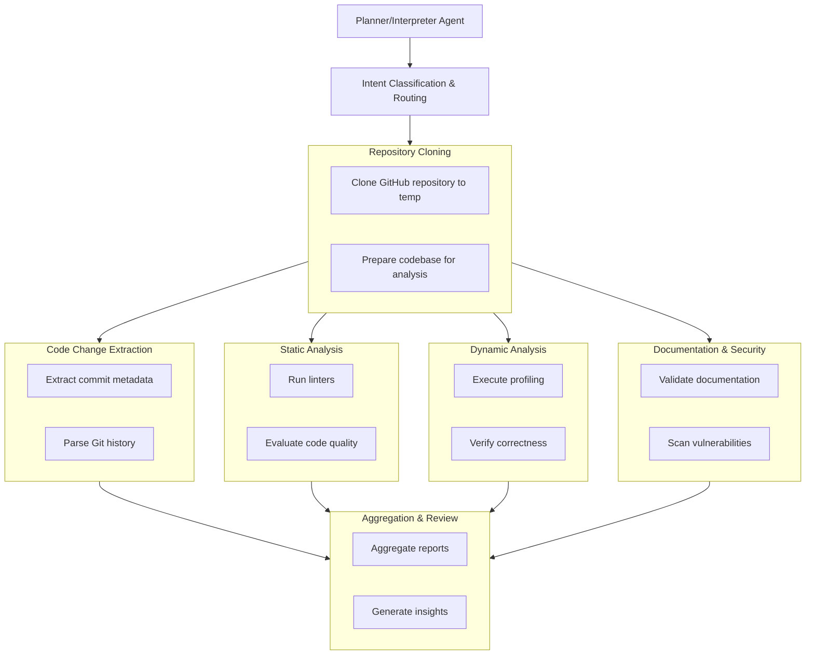

# Multi-Agent Code Review System
(Work in progress) A multi-agent system for automated and intelligent code review.  Leveraging AI and collaborative agents to improve code quality, streamline workflows, and enhance team collaboration.

The top-level task "Automated Code Review" is decomposed into a hierarchy where the Planner/Interpreter Agent interprets the intent from user input and manages subordinate agents. Each agent focuses on a specific task, making the system modular and scalable. The intermediate output will then be passed to an Aggregation & Review Agent for consolidation

<br>


<br>

We can use TypedDict for managing state/memory of the workflow
```python
##  states.py
from typing import TypedDict, List, Dict
from datetime import datetime

class RepositoryState(TypedDict):
    temp_path: str
    branch: str
    is_prepared: bool

class ChangesetState(TypedDict):
    changed_files: List[str]
    commit_data: Dict[str, any]
    diff_stats: Dict[str, int]

class TaskState(TypedDict):
    repository_url: str
    commit_hash: str
    pending_agents: List[str]
    completed_agents: List[str]

class AgentCoordinator(TypedDict):
    workflow_id: str
    status: str
    task_queue: Dict[str, List[str]]
    current_state: TaskState
    agent_states: Dict[str, Dict]
```
